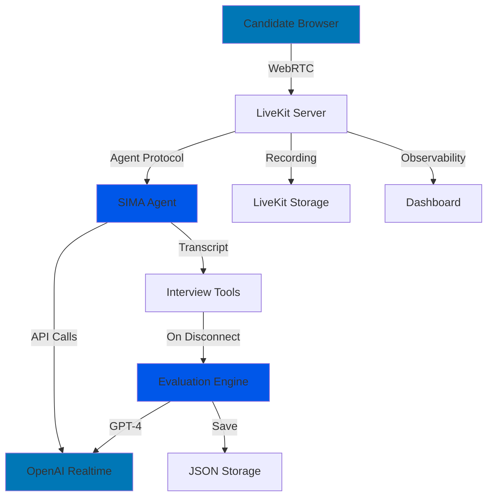

# 🏗️ AI Interview Assistant - System Architecture

## Table of Contents
- [System Overview](#system-overview)
- [Architecture Diagram](#architecture-diagram)
- [Component Details](#component-details)
- [Data Flow](#data-flow)
- [Technology Stack](#technology-stack)
- [Design Patterns](#design-patterns)
- [Scalability & Performance](#scalability--performance)
- [Security Considerations](#security-considerations)

---

## System Overview

The AI Interview Assistant is a distributed, real-time system built on a microservices-inspired architecture. It leverages WebRTC for low-latency audio communication, AI models for intelligent conversation, and cloud infrastructure for scalability.

### High-Level Architecture

```
┌─────────────────────────────────────────────────────────────────┐
│                         CLIENT LAYER                            │
├─────────────────────────────────────────────────────────────────┤
│  Web Browser (LiveKit React SDK)                                │
│  - WebRTC Audio/Video                                           │
│  - Real-time Transcription Display                              │
│  - Session Recording Playback                                   │
└────────────────┬────────────────────────────────────────────────┘
                 │ WebRTC (SRTP/DTLS)
                 ▼
┌─────────────────────────────────────────────────────────────────┐
│                      COMMUNICATION LAYER                        │
├─────────────────────────────────────────────────────────────────┤
│  LiveKit Cloud Server                                           │
│  - SFU (Selective Forwarding Unit)                              │
│  - Media Routing                                                │
│  - Recording & Storage                                          │
│  - Observability Dashboard                                      │
└────────────────┬────────────────────────────────────────────────┘
                 │ LiveKit Agents Protocol
                 ▼
┌────────────────────────────────────────────────────────────────┐
│                        APPLICATION LAYER                       │
├────────────────────────────────────────────────────────────────┤
│  SIMA Agent (Python)                                           │
│    ┌──────────────────────────────────────────────────┐        │
│    │  agent.py         - Main server & orchestration  │        │
│    │  prompts.py       - AI behavior instructions     │        │
│    │  tools.py         - Interview utilities          │        │
│    │  evaluation.py    - Post-interview analysis      │        │
│    │  interview_config - Role configurations          │        │
│    └──────────────────────────────────────────────────┘        │
└────────────────┬───────────────────────────────────────────────┘
                 │ REST API
                 ▼
┌────────────────────────────────────────────────────────────────┐
│                      AI LAYER                                  │
├────────────────────────────────────────────────────────────────┤
│  OpenAI Services                                               │
│  - Realtime API (Voice Conversation)                           │
│  - GPT-4o (Evaluation & Analysis)                              │
│  - Whisper (Speech-to-Text)                                    │
└────────────────┬───────────────────────────────────────────────┘
                 │
                 ▼
┌─────────────────────────────────────────────────────────────────┐
│                     DATA LAYER                                  │
├─────────────────────────────────────────────────────────────────┤
│  - JSON Files (evaluations/)                                    │
│  - Chat History (Json_conversation/)                            │
│  - Future: MongoDB for persistence                              │
└─────────────────────────────────────────────────────────────────┘
```

---

## Architecture Diagram

### Component Interaction Flow



---

## Component Details

### 1. **Client Layer** (Browser)

**Technology:** LiveKit React SDK, WebRTC

**Responsibilities:**
- Capture user audio via microphone
- Establish secure WebRTC connection
- Display real-time transcription
- Render agent video (if avatar enabled)

**Key Features:**
- Noise suppression
- Echo cancellation
- Adaptive bitrate
- Network resilience

---

### 2. **Communication Layer** (LiveKit Server)

**Technology:** LiveKit Cloud (India region)

**Components:**

#### a) Selective Forwarding Unit (SFU)
- Routes media streams between participants
- Low-latency audio transmission (<100ms)
- Bandwidth optimization

#### b) Recording Service
- Automatic session recording
- Audio/video storage
- Transcript generation
- Cloud storage integration

#### c) Observability Dashboard
- Real-time session monitoring
- Transcript viewing
- Analytics and metrics
- Chat history export

**Data Flow:**
```
Candidate Audio → Noise Cancellation → SFU → Agent
Agent Audio → SFU → Candidate
```

---

### 3. **Application Layer** (SIMA Agent)

**Technology:** Python 3.13, LiveKit Agents SDK

#### Core Components:

##### a) **agent.py** - Main Server
```python
AgentServer
├── RTC Session Handler
│   ├── Session Initialization
│   ├── Event Listeners
│   │   ├── conversation_item_added
│   │   ├── participant_disconnected
│   │   └── error handlers
│   └── Transcript Capture
└── Post-Interview Pipeline
    └── Evaluation Trigger
```

**Responsibilities:**
- Manage WebRTC sessions
- Handle audio I/O with noise cancellation
- Capture conversation in real-time
- Detect candidate role from introduction
- Trigger evaluation on session end

##### b) **prompts.py** - AI Behavior Engine
```
SYSTEM_INSTRUCTION
├── Role Definition
├── Language Enforcement (English Only)
└── Behavioral Boundaries

AGENT_INSTRUCTION  
├── Interview Structure (6 phases)
├── Adaptive Questioning
│   ├── Role Detection
│   ├── Experience Level Detection
│   └── Dynamic Question Selection
├── Time Management (20-25 min)
└── Conversation Style (Human-like)

INTERVIEW_OBJECTIVE
├── Technical Skills (35%)
├── Problem-Solving (25%)
├── Communication (15%)
├── Experience (20%)
└── Cultural Fit (5%)
```

**Key Features:**
- Role-adaptive prompts
- Fresher vs Experienced detection
- Bluff detection strategies
- Natural conversation flow

##### c) **tools.py** - Interview Utilities
```python
InterviewTools
├── Transcript Management
│   ├── add_to_transcript()
│   ├── auto_detect_candidate_name()
│   └── auto_detect_position()
├── Interview State
│   ├── interview_stage
│   ├── questions_asked
│   └── candidate_info
├── Behavior Detection
│   ├── check_inappropriate_behavior()
│   └── warning_count tracking
└── Data Export
    └── get_interview_data_for_evaluation()
```

##### d) **evaluation.py** - AI Evaluation Engine
```python
InterviewEvaluator
├── evaluate_interview()
│   ├── Transcript Analysis
│   ├── GPT-4 Scoring
│   └── Report Generation
├── Scoring Dimensions
│   ├── Technical: 1-10
│   ├── Problem-Solving: 1-10
│   ├── Communication: 1-10
│   ├── Experience: 1-10
│   └── Culture Fit: 1-10
└── Output
    ├── JSON Report
    ├── Hiring Recommendation
    └── Role Fit Percentage
```

---

### 4. **AI Layer** (OpenAI)

#### a) **Realtime API** (Real-time Voice)
- **Model:** GPT-4o-realtime
- **Voice:** Coral (professional, neutral)
- **Temperature:** 0.8 (natural, varied responses)
- **Features:**
  - Streaming audio I/O
  - Low latency (<300ms)
  - Interruption handling
  - Context awareness

#### b) **GPT-4** (Evaluation)
- **Model:** GPT-4o
- **Temperature:** 0.3 (consistent evaluation)
- **Output:** Structured JSON
- **Prompt:** 4000-character evaluation instruction

**Evaluation Prompt Structure:**
```
CONTEXT:
- Candidate name, position, duration
- Interview notes
- Full transcript

TASK:
- Analyze across 5 dimensions
- Rate 1-10 with evidence
- Provide strengths/weaknesses
- Generate hiring recommendation
- Calculate role fit percentage

OUTPUT FORMAT: JSON
```

---

### 5. **Data Layer**

#### Current Implementation (File-based)

**Structure:**
```
evaluations/
├── Aman_AI_Developer_20260123_143052.json
├── Rutuja_Frontend_Developer_20260123_142739.json
└── ...

Json_conversation/
├── p_64yg1tqalc3_RM_DNxSHzpBpqtT_chat_history.json
└── ...
```

**JSON Schema:**
```json
{
  "metadata": {
    "candidate_name": "string",
    "position": "string",
    "interview_date": "ISO 8601",
    "duration_minutes": "integer"
  },
  "ratings": {
    "overall_score": "1-10",
    "technical_competency": "1-10",
    ...
  },
  "recommendation": {
    "decision": "Strong Hire | Hire | Maybe | No Hire",
    "role_fit_percentage": "0-100",
    ...
  }
}
```

#### Future Implementation (MongoDB)
```
Collections:
├── interviews
│   ├── transcript
│   ├── candidate_info
│   └── session_metadata
├── evaluations
│   ├── ratings
│   └── recommendations
└── candidates
    ├── profile
    └── interview_history
```

---

## Data Flow

### 1. Interview Session Flow

```
1. Candidate Joins
   ↓
2. LiveKit establishes WebRTC connection
   ↓
3. SIMA agent receives session event
   ↓
4. Agent initializes OpenAI Realtime
   ↓
5. SIMA greets candidate (SESSION_INSTRUCTION)
   ↓
6. Conversation begins
   ├── Audio: Candidate → LiveKit → Agent → OpenAI → Agent → LiveKit → Candidate
   ├── Transcript: Auto-captured via conversation_item_added events
   └── State: Position/name auto-detected
   ↓
7. Interview conducts (20-25 min)
   ├── Phase 1: Introduction + Comfort
   ├── Phase 2: Experience Discussion
   ├── Phase 3: Technical Questions
   ├── Phase 4: Behavioral Questions
   ├── Phase 5: Scenario/Problem-Solving
   └── Phase 6: Wrap-up
   ↓
8. Candidate disconnects
   ↓
9. participant_disconnected event fires
   ↓
10. Evaluation pipeline triggered
```

### 2. Evaluation Generation Flow

```
1. Trigger: participant_disconnected event
   ↓
2. Extract interview data
   ├── Transcript (from InterviewTools)
   ├── Candidate name (auto-detected)
   ├── Position (auto-detected)
   ├── Duration (calculated)
   └── Notes (collected during interview)
   ↓
3. Call InterviewEvaluator
   ↓
4. Generate evaluation prompt
   ├── Context: Interview details
   ├── Task: Analyze & score
   └── Format: Structured JSON
   ↓
5. Send to GPT-4
   ↓
6. Parse JSON response
   ↓
7. Save to evaluations/[name]_[position]_[timestamp].json
   ↓
8. Display summary in console
```

### 3. Manual Evaluation Flow (Fallback)

```
1. User runs: python generate_evaluation_from_json.py [file].json
   ↓
2. Load chat history JSON from Json_conversation/
   ↓
3. Parse conversation items
   ├── Extract transcript
   ├── Detect candidate name
   └── Detect position from keywords
   ↓
4. Call evaluation engine (same as auto)
   ↓
5. Save & display results
```

---

## Technology Stack

### Core Technologies

| Layer | Technology | Version | Purpose |
|-------|-----------|---------|---------|
| **Runtime** | Python | 3.13 | Application logic |
| **Communication** | LiveKit | Latest | Real-time audio/video |
| **AI - Conversation** | OpenAI Realtime API | GPT-4o | Voice interaction |
| **AI - Evaluation** | OpenAI GPT-4 | GPT-4o | Post-interview analysis |
| **STT** | OpenAI Whisper | Latest | Speech transcription |
| **Noise Cancellation** | LiveKit BVC | Latest | Audio enhancement |

### Python Dependencies

```
livekit>=0.17.0           # Real-time communication SDK
livekit-agents>=0.9.0     # Agent framework
livekit-plugins-openai    # OpenAI integration
openai>=1.0.0             # OpenAI API client
python-dotenv>=1.0.0      # Environment management
```

### Infrastructure

- **Hosting:** LiveKit Cloud (India region)
- **Storage:** Local filesystem (JSON)
- **Observability:** LiveKit Dashboard
- **Future:** MongoDB Atlas for persistence

---

## Design Patterns

### 1. **Event-Driven Architecture**

```python
@session.on("conversation_item_added")
def on_conversation_item_added(item):
    # React to events, don't poll
    
@session.on("participant_disconnected")  
def on_participant_disconnected(participant):
    # Trigger evaluation asynchronously
```

**Benefits:**
- Low latency
- Decoupled components
- Scalable

### 2. **Strategy Pattern** (Role Adaptation)

```python
# Detect role
if "UI/UX Designer":
    questions = ui_ux_questions
elif "Backend Developer":
    questions = backend_questions
```

**Benefits:**
- Runtime adaptability
- Easy to extend new roles

### 3. **Template Method Pattern** (Interview Flow)

```python
# Fixed structure, variable content
def conduct_interview():
    greet()              # Fixed
    detect_role()        # Fixed
    ask_questions()      # Variable (role-based)
    evaluate()           # Fixed
```

### 4. **Singleton Pattern** (Evaluator)

```python
class InterviewEvaluator:
    def __init__(self):
        self.client = openai.OpenAI()  # Reuse connection
```

---

## Scalability & Performance

### Current Capacity

- **Concurrent Interviews:** 10-50 (limited by OpenAI rate limits)
- **Interview Duration:** 20-25 minutes
- **Throughput:** ~100-150 interviews/day
- **Latency:** <300ms (speech-to-response)

### Bottlenecks

1. **OpenAI API Rate Limits**
   - Solution: Request limit increase, implement queuing

2. **File-based Storage**
   - Solution: Migrate to MongoDB

3. **Single Server Instance**
   - Solution: Horizontal scaling with load balancer

### Scaling Strategy

```
Phase 1 (Current): Single instance, file storage
Phase 2: Multi-instance, MongoDB
Phase 3: Kubernetes deployment, Redis caching
Phase 4: CDN for static assets, global regions
```

---

## Security Considerations

### 1. **Data Protection**

- ✅ **Encryption in Transit:** TLS 1.3 (WebRTC DTLS)
- ✅ **API Keys:** Environment variables, never in code
- ⚠️ **Data at Rest:** Plain JSON (Future: MongoDB encryption)

### 2. **Authentication & Authorization**

- **Current:** LiveKit room tokens (temporary)
- **Future:** JWT-based auth, role-based access

### 3. **Privacy**

- Transcripts stored locally
- Evaluation data anonymizable
- GDPR compliance considerations

### 4. **Input Validation**

```python
# Sanitize filenames
position = position.replace("/", "-")  # Prevent path traversal
```

### 5. **Rate Limiting**

- OpenAI API: Built-in rate limits
- LiveKit: Connection limits
- Future: Application-level rate limiting

---

## Monitoring & Observability

### Current Implementation

1. **Console Logging**
```python
print("📝 Captured: candidate... (45 chars)")
print("🎯 Position detected: Backend Developer")
```

2. **LiveKit Dashboard**
- Real-time session monitoring
- Transcript viewing
- Analytics

### Future Enhancements

- **Metrics:** Prometheus + Grafana
- **Logging:** ELK Stack (Elasticsearch, Logstash, Kibana)
- **Tracing:** OpenTelemetry
- **Alerting:** PagerDuty for failures

---

## Error Handling

### Graceful Degradation

```python
try:
    evaluation = await generate_evaluation()
except Exception as e:
    logger.error(f"Evaluation failed: {e}")
    # Continue - don't crash entire system
```

### Retry Logic

```python
# Future: Exponential backoff for API calls
for attempt in range(3):
    try:
        response = await openai_call()
        break
    except RateLimitError:
        await asyncio.sleep(2 ** attempt)
```

---

## Future Architecture Enhancements

### Short-term (1-3 months)

- [ ] MongoDB integration
- [ ] Redis caching for frequent queries
- [ ] Automated testing suite
- [ ] CI/CD pipeline (GitHub Actions)

### Medium-term (3-6 months)

- [ ] Multi-language support
- [ ] Video recording & analysis
- [ ] ATS integration (APIs)
- [ ] Analytics dashboard

### Long-term (6-12 months)

- [ ] Kubernetes deployment
- [ ] Global regions (US, EU, APAC)
- [ ] Advanced AI features (sentiment analysis)
- [ ] Mobile app

---

<div align="center">

**Architecture Document v1.0**  
Last Updated: January 2026  

</div>
